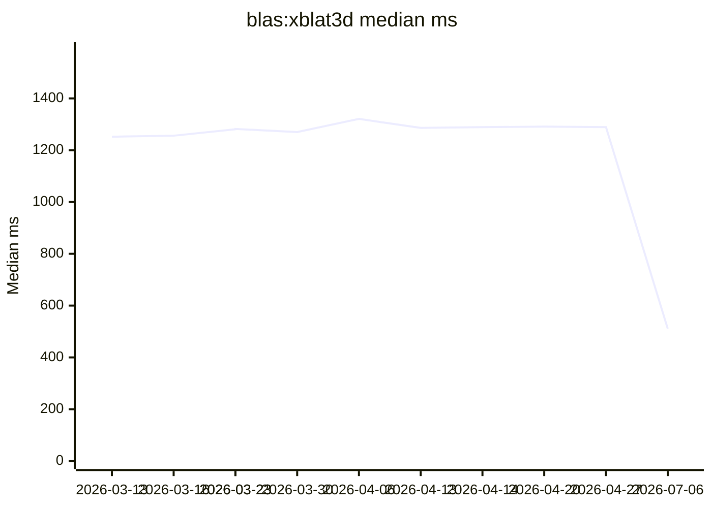
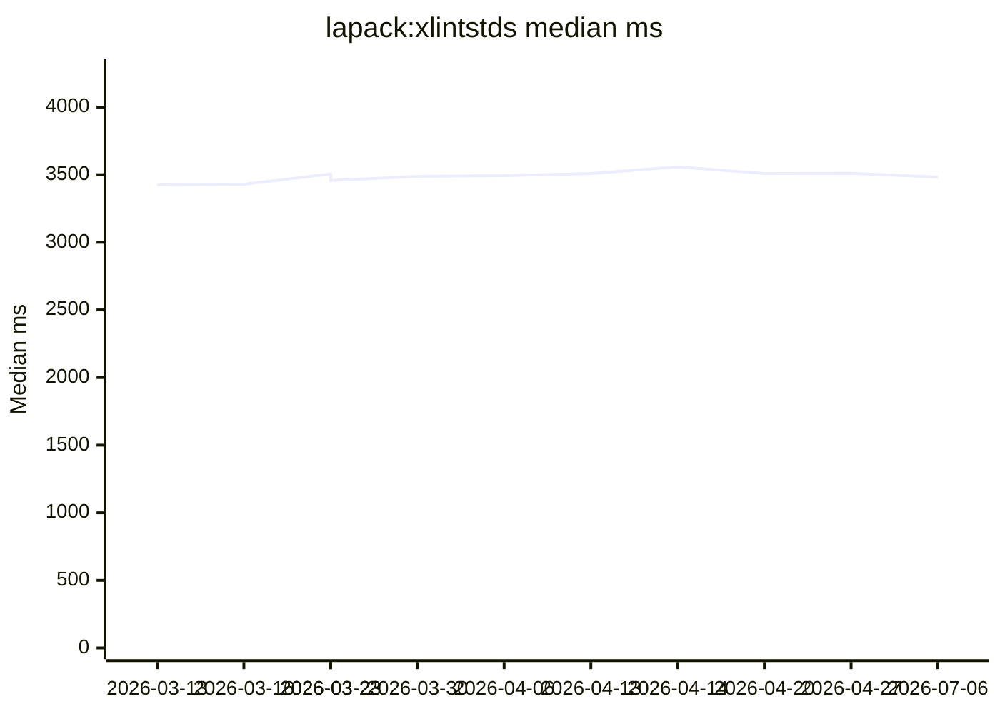

# Performance Dashboard

Auto-generated from the weekly performance workflow.

- Latest run: `2026-07-06`
- Commit: `ef3d51bbd7a1e1da5df45a95e43c85a420bc9e58`
- Samples: iterations `3`, warmup `1`

## Latest Snapshot

| Case | Median (ms) | Mean (ms) | Previous Median (ms) | Delta |
| --- | ---: | ---: | ---: | ---: |
| `blas:xblat3d` | 511.000 | 528.000 | 1289.000 | -60.36% |
| `lapack:xlintstds` | 3482.000 | 3482.000 | 3510.000 | -0.80% |

## Trend Charts (Last 12 Runs)

### `blas:xblat3d`

### `lapack:xlintstds`

## Recent History (Last 12 Runs)

| Run | Commit | `blas:xblat3d` | `lapack:xlintstds` |
| --- | --- | ---: | ---: |
| `2026-03-13` | `e09f5c7cee5bce7c2e1d3a32eefe07f08273216f` | 1252.000 | 3425.000 |
| `2026-03-16` | `3ae72d38f143500a2f3d9a0c76e09fec2f4191e4` | 1256.000 | 3430.000 |
| `2026-03-23` | `5e09dbc138efaab08e29d1c3c5dde3bb3cd94622` | 1281.000 | 3505.000 |
| `2026-03-23` | `5efee15b4373ee7ca2f9119ec04d8eb0aeb67d93` | 1282.000 | 3457.000 |
| `2026-03-30` | `a802e505b2e0cc2e63fa48fd883a396939f6eb8a` | 1270.000 | 3488.000 |
| `2026-04-06` | `365f48763596e52f6b6c6c5f8b4752f1362509f8` | 1321.000 | 3493.000 |
| `2026-04-13` | `522e82f19ec1d455c749d47ea7a0af580bde91cb` | 1286.000 | 3509.000 |
| `2026-04-14` | `3d030d5214fb73b93b79bf5caec908fb9492adbe` | 1289.000 | 3558.000 |
| `2026-04-20` | `5b7181db24747b0444b6edc428b97501ccffc4e7` | 1291.000 | 3509.000 |
| `2026-04-27` | `f815d7b444422afd7159c873dbe7dfee4bcf30be` | 1289.000 | 3510.000 |
| `2026-07-06` | `ef3d51bbd7a1e1da5df45a95e43c85a420bc9e58` | 511.000 | 3482.000 |
